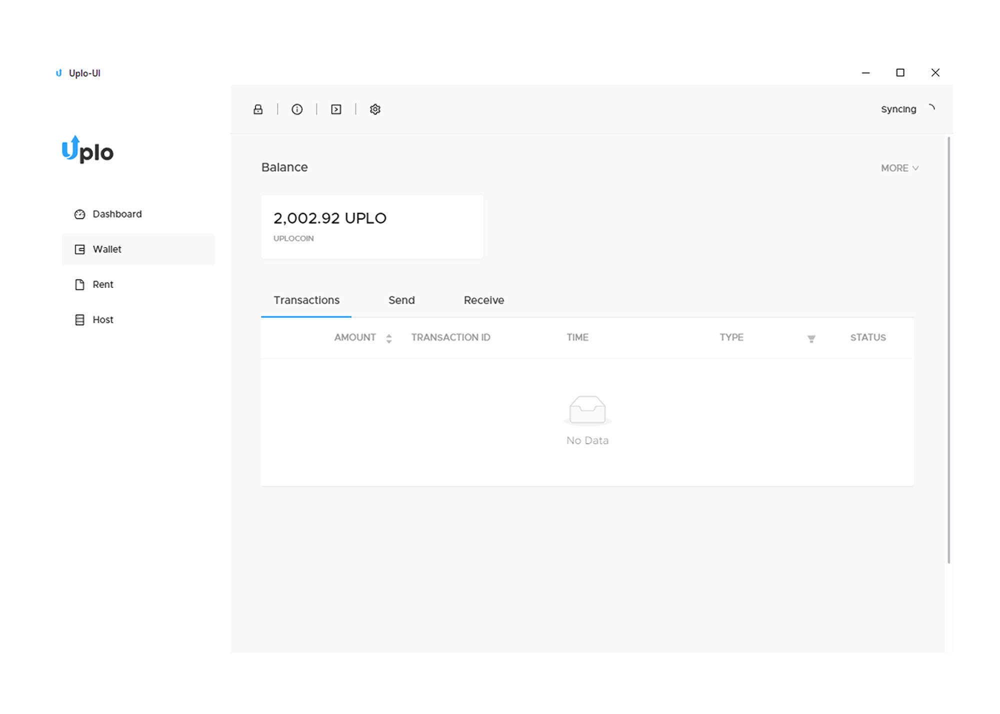

# Uplo-UI
Uplo UI is an Electron app that provides a user interface for common wallet, file-renting, and file-hosting features on Uplo.

## Notes
- You can download the latest signed release of Uplo-UI [here](https://uplo.tech/get-started).
- If you're comfortable with the CLI, consider using the [daemon](https://github.com/uplo-tech/Uplo).

## Architecture
- Node
- Yarn
- Electron
- React
- Redux Saga (newer features are moving to hooks)
- Ant-Design
- Styled Components

## Setting up the developer environment
To get started, clone the repo into your environment.

```
git clone git@gitlab.com:NebulousLabs/Uplo-UI.git
```

>We need to ensure that a compatible version of node is installed that [node-pty-prebuilt-multiarch](https://www.npmjs.com/package/node-pty-prebuilt-multiarch)  has binaries for. At a minimum, use Node 10 or higher. I recommend using Node v12.14.0 or higher. You can use [nvm](https://github.com/nvm-sh/nvm) to make version management easier between different projects.

Once the repo is cloned, we need to install all of the external packages. To do this, `cd` into your project directory and run
```
yarn
```
>If you don't have yarn installed, head over to https://yarnpkg.com/en/

>If you have issues with packages, try deleting the `yarn.lock` file, deleting the `node_modules` folder, and running `yarn` again.

Once all the packages are installed, we need to ensure `node-pty` is properly sourced for your platform. Let's go ahead and build a copy of the Electron app so that gets sourced in. The commands will vary slightly depending on your OS.

### Mac
```
yarn package
```
### Linux
```
yarn package-linux
```
### Windows
```
yarn package-all
```

You can verify that the package completed successfully by checking that there is a `release` folder with correct binaries. The app won't work if you open it, and that's fine, because the app hasn't sourced the proper `uplod` and `uploc` binaries yet. Let's set that up now.

>`uplod` is the main Golang binary that the Electron app interfaces with through a REST api.

>`uploc` is a companion binary that makes it easy to interface with `uplod`. It's used in the terminal modal of Uplo-UI.

Both binaries are platform specific. You can download latest signed binaries [here](https://uplo.tech/get-started).

Once you have the binaries downloaded or built, create a new directory named `bin` along with subfolders specifying each OS:
```
mkdir -p bin/{linux,mac,win}
```

Copy the platform specific binaries into their relative folders. For example, the mac binaries would go into the `mac` folder, and the windows binaries (`uplod.exe` and `uploc.exe`) would go into the `win` folder.


